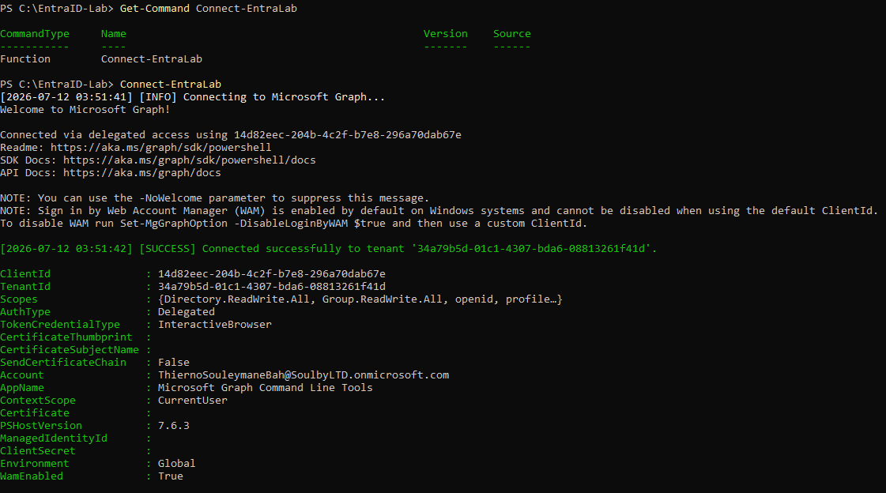
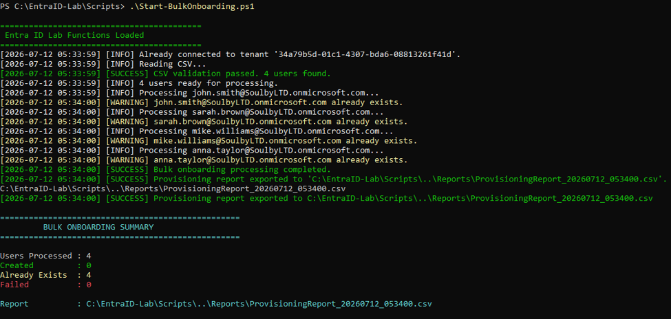
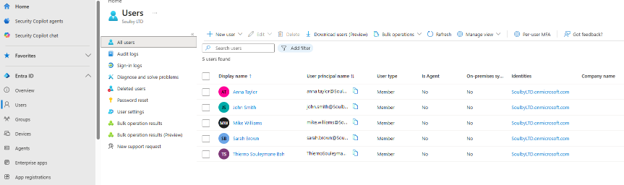
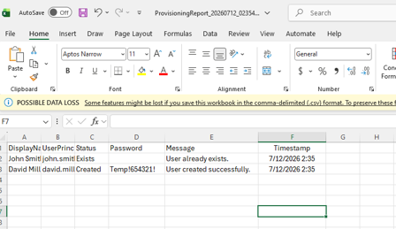

# Microsoft Entra ID Identity Lifecycle Automation

Enterprise identity lifecycle automation using **PowerShell 7** and the **Microsoft Graph PowerShell SDK**.


---

# Overview

This repository demonstrates a modular Microsoft Entra ID identity lifecycle automation framework built with PowerShell 7 and the Microsoft Graph PowerShell SDK.

The solution automates enterprise onboarding by validating CSV data, provisioning users, creating department security groups, assigning Microsoft 365 licenses, generating provisioning reports, and logging every operation.

The project follows enterprise automation best practices including reusable functions, structured logging, robust error handling, configuration-driven design, and Git-based versioning..

The solution was built following enterprise automation principles:

- Modular reusable functions
- Structured logging
- Error handling
- Git versioning
- Microsoft Graph authentication
- CSV reporting

---

# Features

- Microsoft Graph authentication
- CSV validation
- Bulk user onboarding
- Duplicate user detection
- Automatic password generation
- Structured logging
- Provisioning report export
- Reusable PowerShell toolkit

---

# Project Architecture

```text
CSV Joiners
      │
      ▼
Validate CSV
      │
      ▼
Connect Microsoft Graph
      │
      ▼
Check Existing User
      │
      ├───────────────┐
      │               │
      ▼               ▼
Already Exists     Create User
      │               │
      └──────┬────────┘
             ▼
Generate Provisioning Report
             ▼
Execution Summary
```

---

# Folder Structure

```text
EntraID-Automation-Lab

Config/
Data/
Docs/
Functions/
Logs/
Reports/
Scripts/

README.md
```

---

# Demonstration

## Microsoft Graph Connection



Successfully establishes a delegated Microsoft Graph session before automation begins.

---

## Bulk User Onboarding



Processes the onboarding CSV, validates input, checks existing accounts, creates users, logs execution, and produces a provisioning report.

---

## Users Created in Microsoft Entra ID



Users successfully provisioned into Microsoft Entra ID using Microsoft Graph.

---

## Provisioning Report



CSV report generated after execution summarizing provisioning results.

---

# Technologies

- PowerShell 7
- Microsoft Graph PowerShell SDK
- Microsoft Entra ID
- Git
- GitHub

---

# Current Version

**v1.1.0**

Completed Projects

- Project 1 — Entra ID User Provisioning Framework
- Project 2 — Bulk User Onboarding Automation

---

# Upcoming Work

- Department Group Automation
- Security Group Assignment
- Microsoft 365 License Assignment
- User Offboarding
- Access Review Reporting
- Azure Automation Integration

---

# Roadmap

See the project roadmap for upcoming releases and planned enhancements.

📄 [ROADMAP.md](ROADMAP.md)

## Project 3 – Department & Security Group Automation

### Features

- Automatic department security group creation
- Automatic group discovery
- Automatic group membership assignment
- Membership validation
- Enhanced provisioning reports
- Idempotent access provisioning
