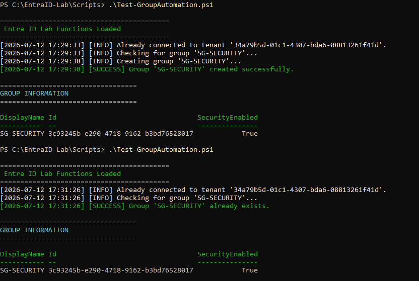
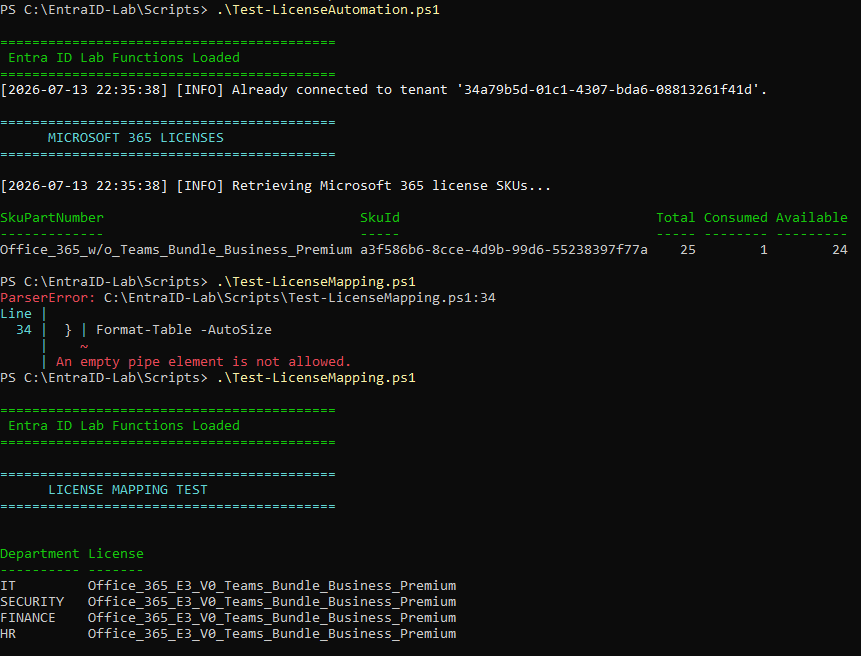
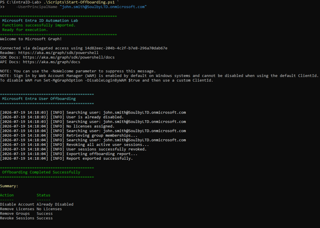
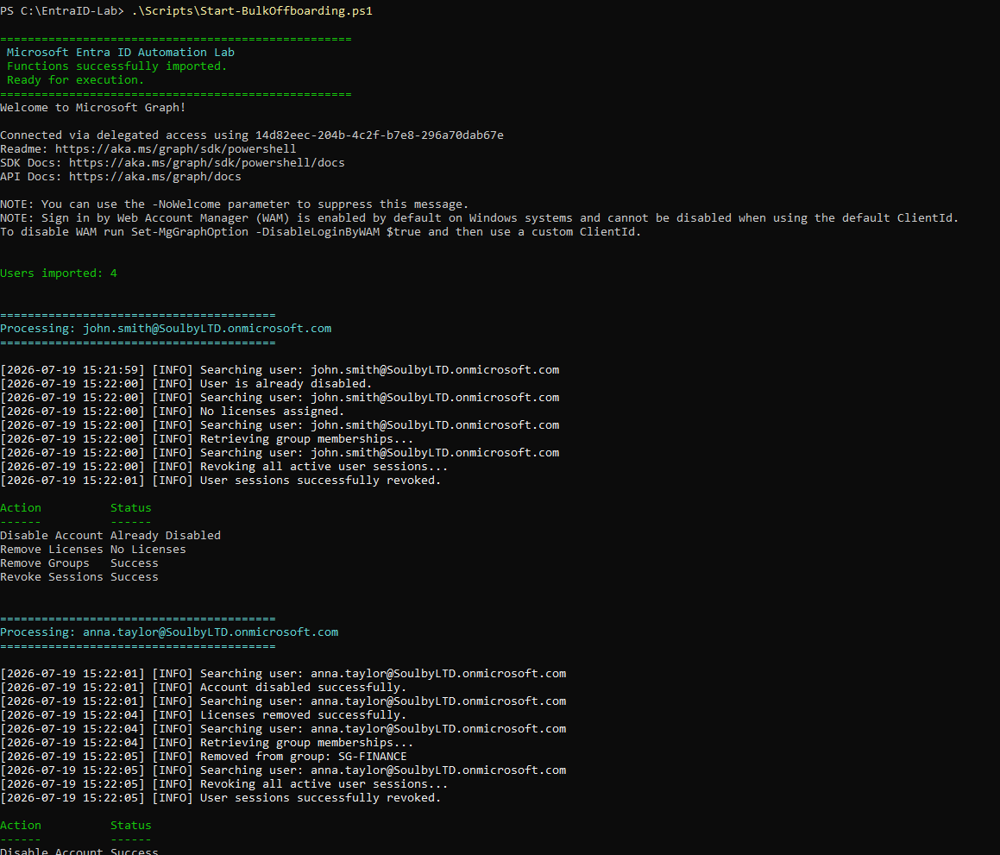
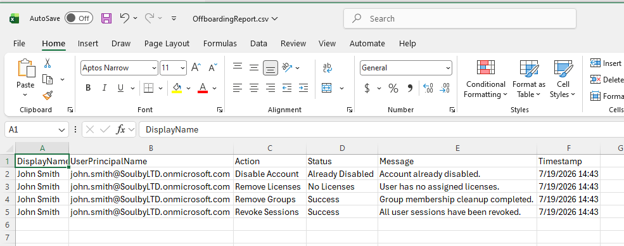

# 🚀 Microsoft Entra ID Identity Lifecycle Automation

Enterprise Identity Lifecycle Automation using **PowerShell 7** and the **Microsoft Graph PowerShell SDK**.


---

## 📑 Table of Contents

- [Overview](#overview)
- [Repository Objectives](#repository-objectives)
- [Features](#features)
- [Project Architecture](#project-architecture)
- [Folder Structure](#folder-structure)
- [Demonstration](#demonstration)
- [Technologies](#technologies)
- [Current Portfolio](#current-portfolio)
- [Skills Demonstrated](#skills-demonstrated)
- [Releases](#releases)
- [Roadmap](#roadmap)
- [About the Author](#about-the-author)
- [Repository Status](#repository-status)
- [License](#license)

---

# Overview

This repository demonstrates a modular **Microsoft Entra ID Identity Lifecycle Automation Framework** built with **PowerShell 7** and the **Microsoft Graph PowerShell SDK**.

The solution automates the complete identity lifecycle by supporting both **user onboarding** and **user offboarding**. It includes user provisioning, department security group automation, Microsoft 365 license assignment and removal, account disablement, session revocation, CSV reporting, and structured logging.

The project follows enterprise automation best practices through:

- Modular reusable PowerShell functions
- Configuration-driven automation
- Structured logging
- Comprehensive error handling
- Microsoft Graph authentication
- CSV reporting
- Git version control
- Enterprise project organization

---

# Repository Objectives

This repository was created to:

- Learn Microsoft Entra ID automation
- Master Microsoft Graph PowerShell SDK
- Build enterprise-quality PowerShell solutions
- Automate Identity Lifecycle Management
- Follow reusable scripting practices
- Demonstrate real-world IAM automation techniques
- Build a professional cybersecurity and cloud portfolio

---

# Features

## User Onboarding

- Microsoft Graph authentication
- CSV validation
- Bulk user onboarding
- Duplicate user detection
- Automatic password generation
- Department security group automation
- Automatic group membership assignment
- Microsoft 365 license mapping
- License availability validation
- Automatic Microsoft 365 license assignment

## User Offboarding

- Disable Microsoft Entra ID user accounts
- Remove Microsoft 365 licenses
- Remove Microsoft Entra security groups
- Revoke active sign-in sessions
- Bulk user offboarding from CSV
- CSV audit reporting

## Framework

- Structured logging
- Error handling
- Configuration-driven automation
- Modular PowerShell toolkit
- Enterprise folder structure

---

# Project Architecture

```text
                  Identity Lifecycle Automation

              CSV Joiners / CSV Leavers
                      │
      ┌───────────────┴────────────────┐
      ▼                                ▼
 User Onboarding                User Offboarding
      │                                │
      ▼                                ▼
 Create User                    Disable User
      │                                │
      ▼                                ▼
 Department Groups             Remove Groups
      │                                │
      ▼                                ▼
 Assign Licenses               Remove Licenses
      │                                │
      ▼                                ▼
 Provision Report              Revoke Sessions
      │                                │
      └───────────────┬────────────────┘
                      ▼
             Reporting & Logging
```

---

# Folder Structure

```text
EntraID-Lab
│
├── Config
├── Data
├── Docs
│   ├── Images
│   └── Project5
│       └── README.md
├── Functions
├── Logs
├── Modules
├── Reports
├── Scripts
├── Templates
├── README.md
└── ROADMAP.md
```

---

# Demonstration

## Microsoft Graph Connection


Successfully establishes a delegated Microsoft Graph session before automation begins.

---

## Bulk User Onboarding


Processes the onboarding CSV, validates input, checks existing accounts, creates users, assigns department groups, assigns Microsoft 365 licenses, and generates a provisioning report.

---

## Users Created in Microsoft Entra ID


Users successfully provisioned into Microsoft Entra ID using Microsoft Graph.

---

## Provisioning Report


CSV report generated after onboarding summarizing provisioning results.

---

## Department Group Automation



Automatically creates department security groups and assigns users to the appropriate groups.

---

## Microsoft 365 License Automation



Automatically maps departments to Microsoft 365 licenses, validates license availability, and assigns licenses using Microsoft Graph.

---

## User Offboarding (Project 5)



Disables Microsoft Entra ID user accounts, removes Microsoft 365 licenses and security group memberships, revokes active sessions, and records the operation in an audit report.

---

## Bulk User Offboarding (Project 5)



Processes multiple users from a CSV file and performs a complete offboarding workflow for each account.

---

## Offboarding Report (Project 5)



Consolidated CSV report generated after bulk offboarding, providing an audit trail of all completed actions.

---

# Technologies

- PowerShell 7
- Microsoft Graph PowerShell SDK
- Microsoft Entra ID
- Microsoft 365
- REST APIs
- JSON Configuration
- CSV Processing
- Git
- GitHub

---

# Current Portfolio

| Project | Status | Version |
|---------|:------:|:------:|
| Project 1 – Identity Provisioning | ✅ | v1.0.0 |
| Project 2 – Bulk User Onboarding | ✅ | v1.1.0 |
| Project 3 – Department & Security Group Automation | ✅ | v1.2.0 |
| Project 4 – Microsoft 365 License Automation | ✅ | v1.3.0 |
| Project 5 – User Offboarding Automation | ✅ | v1.4.0 |

---

# Skills Demonstrated

## Identity & Access Management

- Microsoft Entra ID Administration
- Identity Lifecycle Management
- User Provisioning
- User Offboarding
- Microsoft 365 License Management
- RBAC & Security Groups

## PowerShell Development

- Advanced PowerShell Functions
- PowerShell Modules
- Modular Script Design
- Pipeline Processing
- Error Handling
- Logging
- CSV Processing
- JSON Configuration

## Microsoft Graph

- User Management
- Group Management
- License Management
- Session Revocation
- Microsoft Graph Authentication

## DevOps

- Git
- GitHub
- Version Control
- Documentation

---

# Releases

| Version | Description |
|----------|-------------|
| v1.0.0 | Identity Provisioning |
| v1.1.0 | Bulk User Onboarding |
| v1.2.0 | Department & Security Group Automation |
| v1.3.0 | Microsoft 365 License Automation |
| **v1.4.0** | **User Offboarding Automation** |

---

# Roadmap

## Completed

- ✅ Identity Provisioning
- ✅ Bulk User Onboarding
- ✅ Department & Security Group Automation
- ✅ Microsoft 365 License Automation
- ✅ User Offboarding Automation

## Planned

- 🔄 Azure Automation Runbooks
- 🔄 Access Review Reporting
- 🔄 Azure Key Vault Integration
- 🔄 Identity Governance Automation
- 🔄 Privileged Identity Management (PIM)

For more details, see:

📄 **ROADMAP.md**

---

# About the Author

**Thierno Bah**

IT Engineer specializing in Microsoft Entra ID, Identity & Access Management (IAM), PowerShell Automation, Microsoft 365 Administration, and Cybersecurity.

### Connect with me

- GitHub: https://github.com/Thierno16
- LinkedIn: https://www.linkedin.com/in/thierno-bah-95931259/

---

# Repository Status

🚀 This repository is actively maintained and continuously expanded through practical Microsoft Entra ID automation projects designed to demonstrate real-world identity lifecycle management, scripting, and enterprise automation techniques.

**Current Release:** **v1.4.0**

**Current Focus**

- Microsoft Entra ID
- Identity Lifecycle Automation
- Microsoft Graph PowerShell
- Enterprise PowerShell Development

---

# License

This project is licensed under the MIT License.